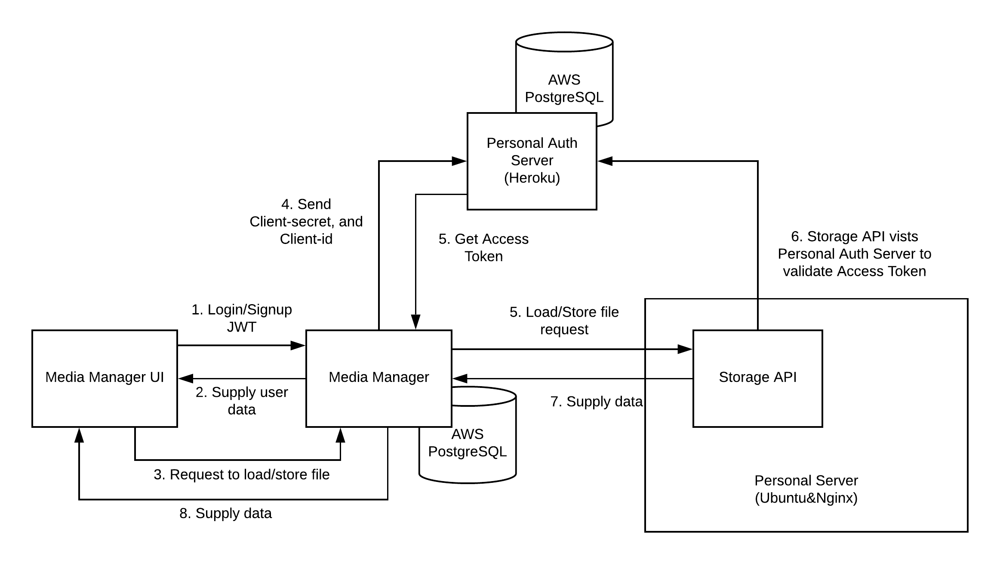

# MediamanagerUi

This project was generated with [Angular CLI](https://github.com/angular/angular-cli) version 9.1.3.

## Branch information
### feature/fourth
This branch has a temporary button to check status of [storage-api(personal-oauth2-resource-01)](https://github.com/paper-driver/storage-api/tree/feature/personal-oauth2-resource-01) for testing purpose.

This branch is utilized to use [mediamanger(personal-oauth2-01)](https://github.com/paper-driver/mediamanager/tree/feature/personal-oauth2-01) to successifully access the api of the storage server.

(5/25/2020) - user can upload and load files from storage but files are stored in the common folder.

#### Access Flow Diagram

**SIDE NOTE**
This branch can also use [mediamanager(feature/fifth)](https://github.com/paper-driver/mediamanager/tree/feature/fifth) with [storage-api(feature/second)](https://github.com/paper-driver/storage-api/tree/feature/second) to achieve GitHub OAuth2 SSO. However, originally, GitHub API is aimed to use Authorization code grant flow, so the token used to establish server-to-server communciation was forcefully obtained through the manual separate requests outside of the network. Therefore, this approach is not recommended.

### feature/third
This branch allows admin to reject or approve role update requests from UI rather than through email links.

However, after rejecting or approving requests, admin has to refresh the page to see the change.

For role update requesters, they need to clean their cache or re-login to see the change of their role in their profile.

This branch is utilized to use [mediamanager(feature/third)](https://github.com/paper-driver/mediamanager/tree/feature/third) as the backend.

### feature/second
This branch allows users to request the change of their roles or password and admin will be notified through email at the backend.

SInce there were some updates in backend [mediamanager(feature/second)](https://github.com/paper-driver/mediamanager/tree/feature/second) endpoints, the environment file in the frontend was also updated accordingly.

## Development server

Run `ng serve` for a dev server. Navigate to `http://localhost:4200/`. The app will automatically reload if you change any of the source files.

## Code scaffolding

Run `ng generate component component-name` to generate a new component. You can also use `ng generate directive|pipe|service|class|guard|interface|enum|module`.

## Build

Run `ng build` to build the project. The build artifacts will be stored in the `dist/` directory. Use the `--prod` flag for a production build.

## Running unit tests

Run `ng test` to execute the unit tests via [Karma](https://karma-runner.github.io).

## Running end-to-end tests

Run `ng e2e` to execute the end-to-end tests via [Protractor](http://www.protractortest.org/).

## Further help

To get more help on the Angular CLI use `ng help` or go check out the [Angular CLI README](https://github.com/angular/angular-cli/blob/master/README.md).
